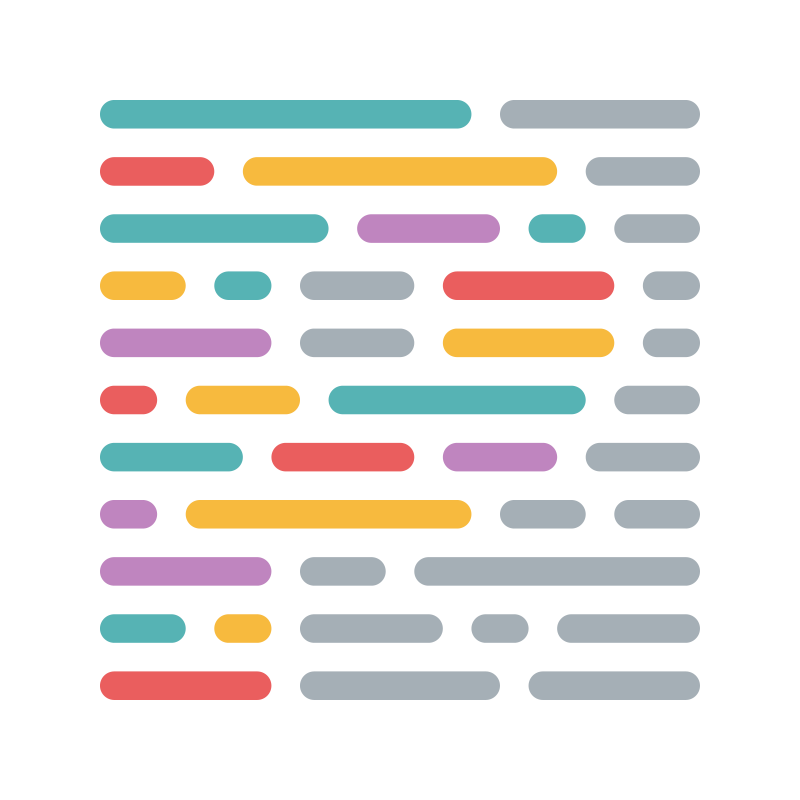
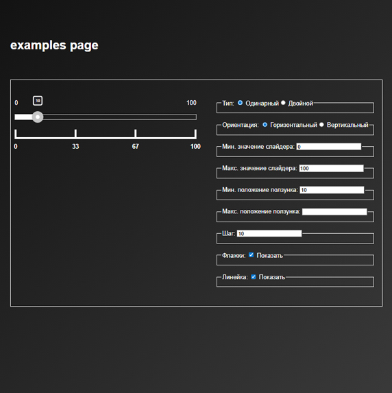
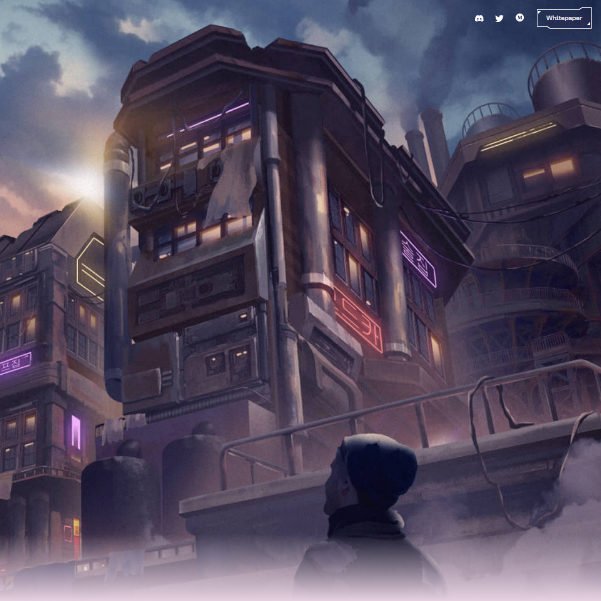
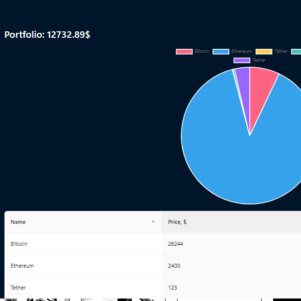
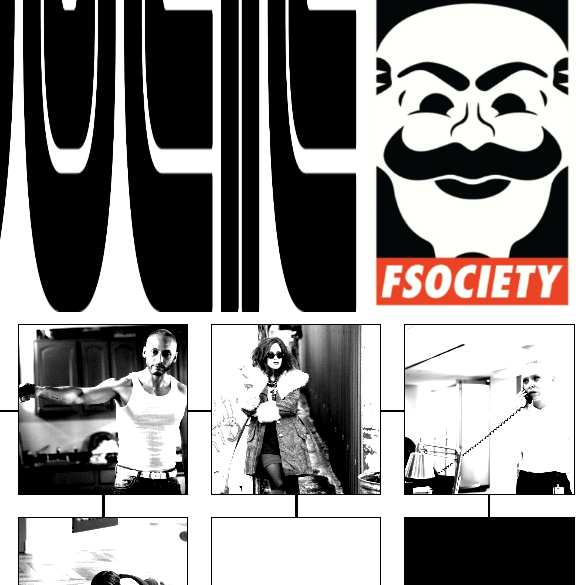

# Привет!🤘 Я Мария Зинкевич

Я ❤️ 𝑭𝒓𝒐𝒏𝒕-𝒆𝒏𝒅 разрботчик!

## Образование:

- СПБ ГБПОУ "Петровский колледж" факультет "Программирование в компьютерных системах".

## Дополнительное образование:

- The Rolling Scopes School (RS School) – бесплатная школа, от сообщества разработчиков The Rolling Scopes - курс front-end разработка.

- Школа MetaLamp - бесплатная образовательная программа, созданная компанией MetaLamp - курс front-end разработка.

- Кодварс 🍩

  

## Мой технический стек

                 

## Некоторые из моих работ:

<table>
    <tr valign="top">
      <td>
          Toxin 
            
      </td>
      <td>
        Технологии❤️:
         PUG, JS + плагины, jQuery + плагины, SCSS, Webpack, Pixel Perfect, Компонентная архитектура
         
        <a href='https://zinmari.github.io/search-for-hotels/index.html' style="color: #f83650; font-weight: 700;">Открыть</a>
      </td>
    </tr>
    <tr valign="top">
      <td>
          jQuery-плагин слайдера 
            
      </td>
      <td>
        Технологии❤️:
         PUG, TS, jQuery, SCSS, Webpack, MVP, Jest, UML
         
        <a href='https://zinmari.github.io/alexandr/' style="color: #f83650; font-weight: 700;">Открыть</a>
      </td>
    </tr>
    <tr valign="top">
      <td>
          Сайт про игру 
            
      </td>
      <td>
        Технологии❤️:
         React, TS, Next.
         В процессе разработки...
         
        <a href='https://cosmo-nine-delta.vercel.app/' style="color: #f83650; font-weight: 700;">Открыть</a>
      </td>
    </tr>
    <tr valign="top">
      <td>
          Портфолио с криптовалютой 
            
      </td>
      <td>
        Технологии❤️:
         React, Vite, Ant Design
         
        <a href='https://react-crypto-app-bay-rho.vercel.app/' style="color: #f83650; font-weight: 700;">Открыть</a>
      </td>
    </tr>
    <tr valign="top">
      <td>
          Постер 
            
      </td>
      <td>
        Технологии❤️:
         HTML, SCSS
         
        <a href='https://zinmari.github.io/Mr.RobotPoster/' style="color: #f83650; font-weight: 700;">Открыть</a>
      </td>
    </tr>
</table>
